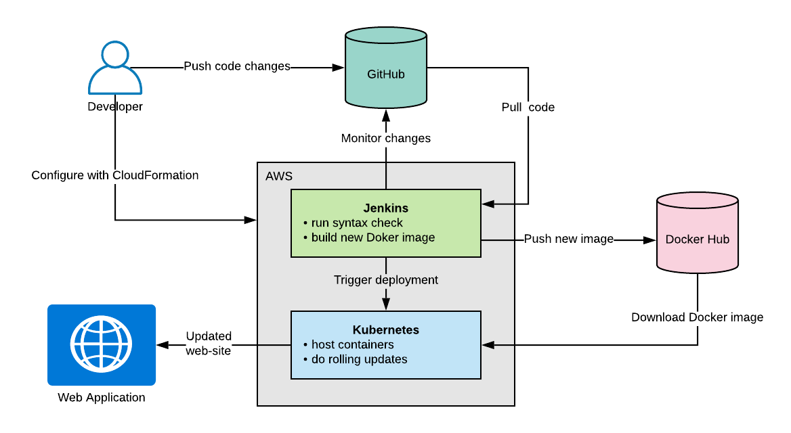
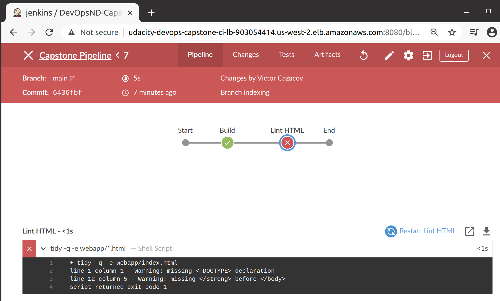
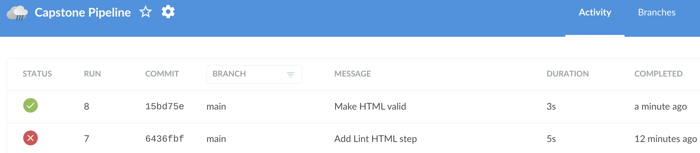
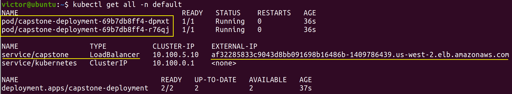
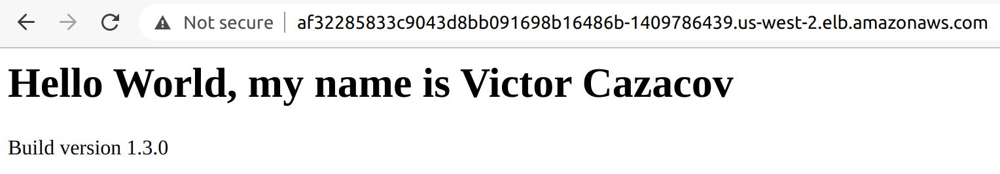
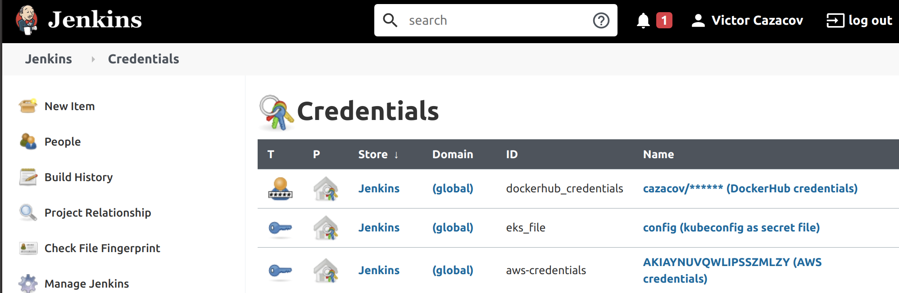
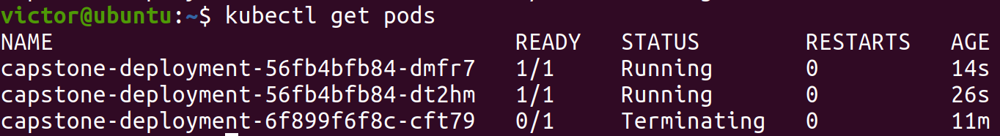
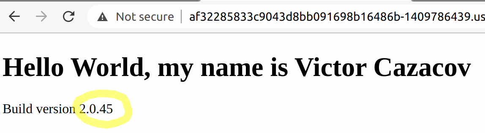
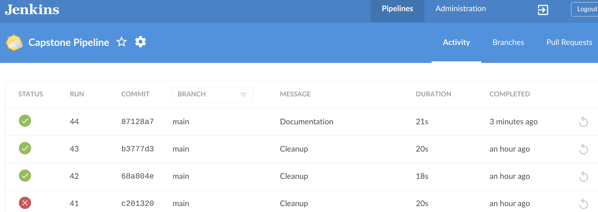

# Udacity DevOpsND Capstone
Capstone Project of Udacity Cloud DevOps Engineer Nanodegree

This project demonstrates the following scenario:



1. Developer pushes new changes to a GitHub repository.
2. Jenkins continuous integration server monitors that repository and starts a new build.
3. The code is checked for syntax errors.
4. If it's Ok, a new Doker image is created.
5. That image is pushed to the image repository (Docker Hub).
6. At the final build step the Jenkins triggers Kubernetes deployment.
7. Kubernetes cluster pulls the desired image from the Docker Hub.
8. Kubernetes one-by-one updates its pods to ensure that at every moment of time the web application is available. 
9. The end users see the updated version of the web application.


## Prerequisites
- AWS CLI for Linux
- Docker
- kubectl
- Pair of public/private SSH keys registered in AWS.

## Infrastructure Setup

### Install Kubernetes

```bash
cd infrastructure-setup
```

Create IAM Role

```bash
./01-create-IAM.sh
```

Create VPC with private und public subntets in two availability zones

```bash
./02-create-network.sh
```

Create EKS instance

```bash
./03-create-EKS.sh
```

Create EKS nodes and tag them

```bash
./04-create-nodes.sh
```

Import Kubernetes configuration

```bash
aws eks --region us-west-2 update-kubeconfig --name udacity-devops-eks

### Check connection
kubectl get pods --all-namespaces
```

### Install Jenkins

Install Jenkins and bastion VM

```bash
./05-create-jenkins.sh
```

After creating CloudFormation stacks the AWS console should show them all having completed status:


The stacks expose variables like Jenkins URL and public IP of the bastion VM:


## Configure Jenkins

The public URL of the Jenkins load-balancer is exposed as CloudFormation stack variable. When you access it for the first time the Jenkins will ask for an unlock key:


To access the file system of the Jenkins VM that runs in a private subnet on AWS we need to login at the Bastion VM first. Then from the Bastion VM we can open SSH connection to the Jenkins server. There is security group that allows Bastion VM open outbound connections with port 22 (SSH) only to the Jenkins server. Also the Jenkins server has security group that allows inbound SSH connections only from the Bastion VM.

Deploy SSH key to the Bastion VM

```bash
scp -i ~/.ssh/udacity-devops-ssh.pem ~/.ssh/udacity-devops-ssh.pem ubuntu@BASTION:~/.ssh/
```

Open SSH connection to Bastion VM

```bash
ssh -i ~/.ssh/udacity-devops-ssh.pem ubuntu@BASTION
```

From the Bastion VM we can now reach the Jenkins server and read the key:

```bash
ssh -i ~/.ssh/udacity-devops-ssh.pem ubuntu@JENKINS

sudo cat /var/lib/jenkins/secrets/initialAdminPassword
```

After successful login in Jenkins on the "geeting started" page install suggested plugins.


Under Manage Jenkins -> Manage Plugins install Blue Ocean.

Under Manage Jenkins -> Global Tool Configuration -> Docker add the local Docker installation (should be located at /usr/bin).


## Configuring CI/CD Pipeline

Create a new Jenlins pipeline and select this GitHub repo as a source.

In the pipeline settings choose to scan repository for changes every minute:


## Build Pipeline

### Lint HTML

This step uses [tidy utility](https://www.html-tidy.org/) to check if our web application HTML have markup errors, contain deprecated legacy code, etc.

If there are HTML errors, the Jenkins build will fail and you can see what's wrong in the tidy output:



After HTML errors are fixed and changes pushed to the GitHub, the status of the pipeline shoud automatically change to green:




## Manual Deployment to Kubernetes

Before automating deployment with Jenkins you may wish to test your Docker build process locally.

```bash
cd ./webapp
dockerpath=cazacov/learning:latest
```

Authenticate at Docker

```bash
docker login -u cazacov
```

Build the image

```bash
docker build --tag=capstone .
```

Tag it

```bash
docker tag capstone $dockerpath
```

Push the image to the DockerHub repository
```bash
docker push $dockerpath
```

Deploy to Kubernetes

```bash
cd ./kubernetes-deployment

kubectl apply -f deployment.yaml
```

Check what's running on K8s

```bash
kubectl get all -n default
```

You should see two Kubernetes pods in the private subnet that run instances of the web-app container and a load-balancer in the public subnet that has external IP address.



Using that external URL you can now access the web application in browser:




## Automated Deployment with Jenkins

In Jenkins -> Manage Jenkins -> Plugin Manager install following plugins:
- Docker Pipeline
- Pipeline: AWS Steps
- Kubernetes CLI plugin

In Jenkins -> Manage Jenkins -> Manage Credentials store in the global scope following credentials:
- dockerhub_credentials  - Login/Password for DockerHub communication
- eks_file - kube config imported from the EKS and stored as a secret file
- aws-credentials - AWS credentials for the user that will make deployments to the EKS cluster



When EKS cluster is created the current user automatically gets permissions to manage it. To grant other users the deployment permissions you need to add user mappings as described [here](https://docs.aws.amazon.com/general/latest/gr/aws-sec-cred-types.html). Run

```bash
kubectl edit configmap aws-auth -n kube-system
```

and add the following block:
```yaml
mapUsers: |
- userarn: arn:aws:iam::579060413136:user/jenkins
    username: jenkins
    groups:
    - system:masters
```        

where "jenkins" is the user name that will make the deployments (Jenkins server runs as this Linux account by default). 579060413136 is my AWS-id, you can find yours in the output of CloudFormation export for the EKS IAM Role. (see screenshot in the section "Install Jenkins").

### Deployment steps in the Jenkinsfile

#### Build Docker image

This step stamps the current build number in HTML page with the SED command and then calls Docker Pipeline to build and tag a new Docker image:
```jenkins
script { 
    sh 'sed -i "s/BUILDNUMBER/$BUILD_NUMBER/g" webapp/index.html'
    dockerImage = docker.build(registry + ":$BUILD_NUMBER", "./webapp") 
}
```

#### Deploy Image to DockerHub

This step also uses Docker Pipeline plugin to login on DockerHub and push image with specific version number and then again the same image tagged as "latest".
```jenkins
script { 
    docker.withRegistry( '', registryCredentials) { 
        dockerImage.push() 
        dockerImage.push('latest') 
    }
} 
```

#### Deploy Web-App to Kubernetes

The final step should also be simple if you can use Jenkins Kubernetes Continuous Deploy plugin. Unfortunately the lastest version of Jenkins has some broken dependencies that are [not resolved yet](https://github.com/jenkinsci/kubernetes-cd-plugin/issues/122). My goal was to automate the build pipeline as much as possible and I did not want to manually downgrade some Jenkins plugins to specific versions, so I decided to use AWS plugin to log-in on EKS and then thrigger new deployment with kubectl:

```jenkins
script {
    withAWS(credentials: 'aws-credentials', region: 'us-west-2') {
        sh 'sed -i "s/latest/$BUILD_NUMBER/g" kubernetes-deployment/deployment.yaml'
        withKubeConfig([credentialsId: 'eks_file', contextName: 'arn:aws:eks:us-west-2:579060413136:cluster/udacity-devops-eks']) {
            sh 'kubectl apply -f kubernetes-deployment/deployment.yaml'
        }
    }
}
```

This code also uses SED to put current build number in the deployment manifest. Generally it's not recommended to reference your container version as "latest" and you should use specific versions instead where possible.

## Rolling Update

After pusing new changs to GitHub repo the Jenkins should automatically detect them and start the build. The Kubernetes deployment is configured to make rolling updates:

```yaml
...
  template:
    metadata:
      labels:
        app: capstone
        role: rolling-update
    spec:
      containers:
      - name: capstone
        image: cazacov/learning:latest
        imagePullPolicy: Always
        ports:
        - containerPort: 80
        readinessProbe:
          httpGet:
            path: /
            port: 80
  strategy:
    type: RollingUpdate
    rollingUpdate:
      maxSurge: 1
      maxUnavailable: 0
```

Running command "kubectl get pods" right after after the push you can catch the moment when Kubernetes one-by-one starts new pods and terminates old versions:



The headers of the HTML page tell browser not to cache the content and refresh page every 10 seconds. Shortly after the build the page should automatically display the new version with the latest build number:



The developer can control the status of the build process with the Jenkins pipeline screen:


