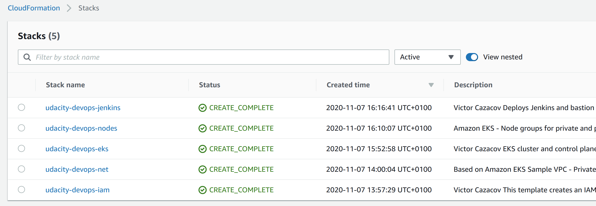
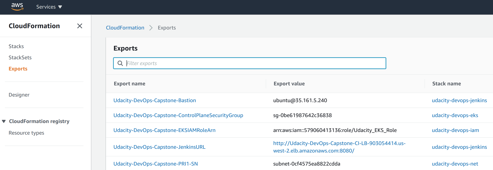
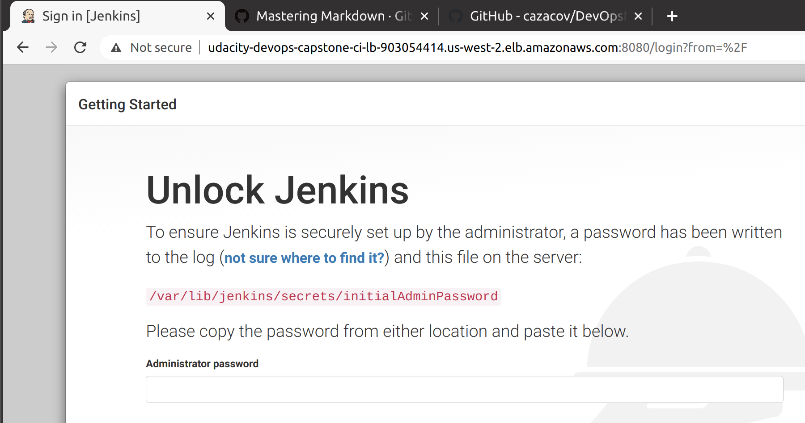
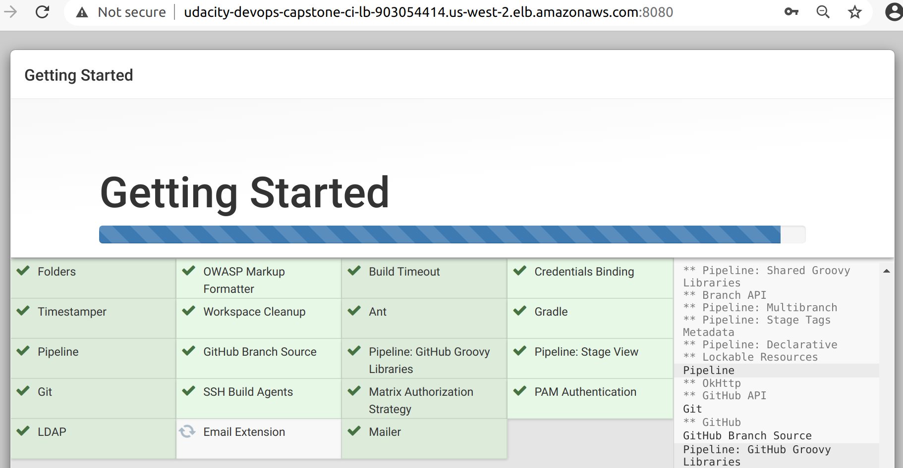
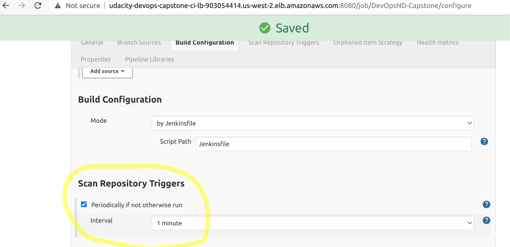

# DevOpsND-Capstone
Capstone Project of Udacity Cloud DevOps Engineer Nanodegree

## Infrastructure Setup

### Install Kubernetes

```bash
cd infrastructure-setup
```

Create IAM Role

```bash
./01-create-IAM.sh
```

Create VPC with private und public subntets in two availability zones

```bash
./02-create-network.sh
```

Create EKS instance

```bash
./03-create-EKS.sh
```

Create EKS nodes and tag them

```bash
./04-create-nodes.sh
```

Import Kubernetes configuration

```bash
aws eks --region us-west-2 update-kubeconfig --name udacity-devops-eks

### Check connection
kubectl get pods --all-namespaces
```

### Install Jenkins

Install Jenkins and bastion VM

```bash
./05-create-jenkins.sh
```

After creating Cloudformation stacks the AWS console should show them having successful status:



The stacks expose variables like Jenkins URL and public IP of the bastion VM:



## Configure Jenkins

The public URL of the Jenkins load-balancer is exposed as Cloudformation stack variable. When you access it for the first time the Jenkins will ask for unlock key:



To access the file system of the Jenkins VM that runs in a private subnet on AWS we need to login at the Bastion VM first. Then from the Bastion VM we can open SSH connection to the Jenkins server. There is security group that allows Bastion VM open outbound connections with port 22 (SSH) only to the Jenkins server. Also the Jenkins server has security group assigned that allows inbound SSH connections only from the Bastion VM.

Deploy SSH key to the Bastion VM

```bash
scp -i ~/.ssh/udacity-devops-ssh.pem ~/.ssh/udacity-devops-ssh.pem ubuntu@BASTION:~/.ssh/
```

Open SSH connection to Bastion VM

```bash
ssh -i ~/.ssh/udacity-devops-ssh.pem ubuntu@BASTION
```

From the Bastion VM we can now reach the Jenkins server and read the key:

```bash
ssh -i ~/.ssh/udacity-devops-ssh.pem ubuntu@JENKINS
sudo cat /var/lib/jenkins/secrets/initialAdminPassword
```

After successful login in Jenkins on the "geeting started" page install suggested plugins.




## Configuring CI/CD Pipeline

Create new Jenlins pipeline and select this GitHub repo as source.

In the pipeline settings choose to scan repository for changes every minute:




## Manual build & deploy

### Build and Push

```bash
cd ./webapp

dockerpath=cazacov/learning:capstone


# Authenticate
docker login -u cazacov

# Build
docker build --tag=capstone .

# Tag
docker tag capstone $dockerpath

# Push image to a docker repository
docker push $dockerpath
```

### Deploy

```bash
cd ./kubernetes-deployment

kubectl apply -f deployment.yaml
```

### Check what's running on K8s
```bash
kubectl get all -n default
```